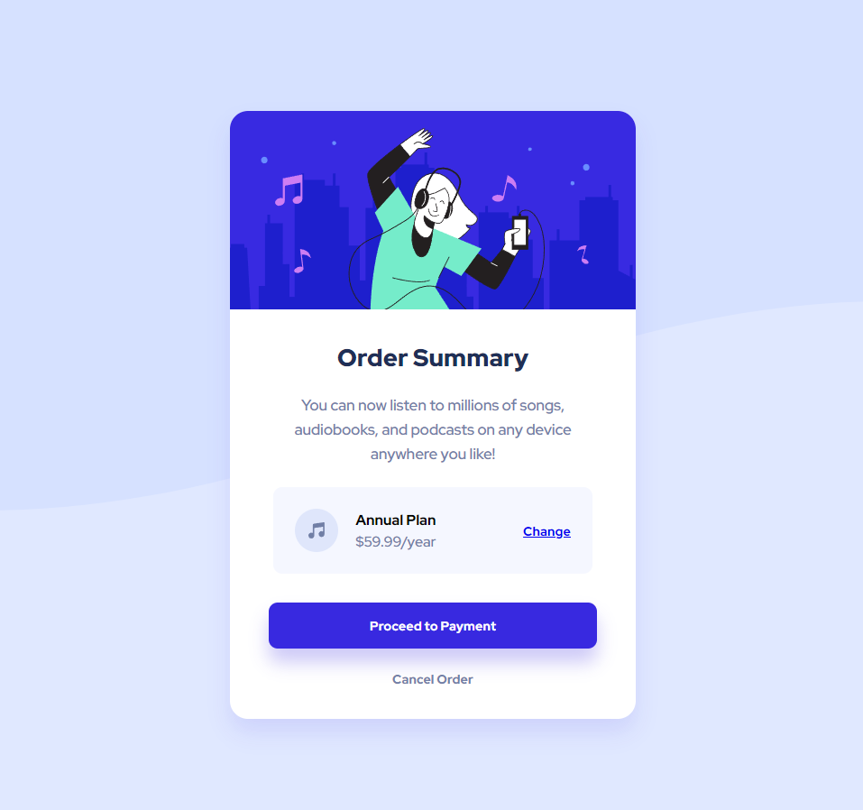

# Frontend Mentor - Order summary card

# Project Name
- A perfect project for newbies who are starting to build confidence with layouts!
- Live demo [Order summary component](https://www.frontendmentor.io/challenges/order-summary-component-QlPmajDUj). 

## Table of Contents
* [General Info](#general-information)
* [Technologies Used](#technologies-used)
* [Features](#features)
* [Screenshots](#screenshots)
* [Acknowledgements](#acknowledgements)
* [Contact](#contact)

## General Information
- This is my first solution of Frontend Mentor. An excellent exercise in combining HTML, CSS and its add-ons like Flexbox. Not forgetting about responsiveness.

## Technologies Used
- HTML5 Markup
- CSS 
- Flexbox
- Grid
- RWD - Responsive Web Design 

## Features
List the ready features here:
- Connection Flexbox with Grid

## Screenshots

## Acknowledgements
- This project was based on [Frontend Mentor](https://www.example.com).

## Contact
Created by [@mr_cyclist] - contact me!

